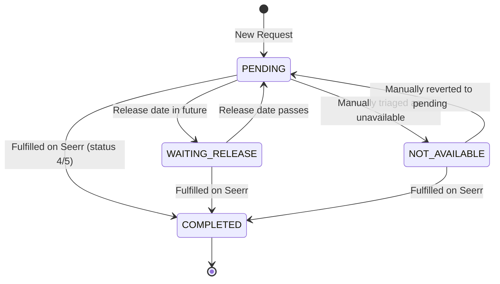

# Limbo AI Agent Development Guidelines (AGENTS.md)

Welcome! This document provides structural, architectural, and operational context for any AI agents or developers working on the Limbo service.

---

## 📂 Project Structure

```
stacks/limbo/
├── compose.yaml              # Docker compose spec
├── .env                      # Local deployment env configuration
├── AGENTS.md                 # Agent instructions (this file)
└── app/                      # Go source code
    ├── Dockerfile            # Multi-stage CGO SQLite build (local dev & testing)
    ├── Dockerfile.release    # Production runtime image using static host-compiled binaries
    ├── .dockerignore         # Exclusions for Docker build context
    ├── go.mod                # Module definitions
    ├── go.sum
    ├── main.go               # Entry point (initializes DB, background ticker, HTTP server)
    │
    ├── internal/
    │   ├── config/
    │   │   └── config.go     # App config parsing & validation
    │   │
    │   ├── database/
    │   │   ├── database.go   # DB initialization (SQLite WAL mode or PostgreSQL)
    │   │   └── models.go     # GORM model definitions & status constants
    │   │
    │   ├── scanner/
    │   │   ├── scanner.go    # Background tick loop, request syncing
    │   │   ├── release.go    # Movie & TV release evaluation rules
    │   │   └── notifier.go   # Discord webhook sender
    │   │
    │   ├── seerr/
    │   │   └── client.go     # Seerr API client with context awareness
    │   │
    │   └── api/
    │       ├── router.go     # Router configuration & middlewares (Chi, CORS, realip)
    │       ├── health.go     # /api/health handler
    │       ├── requests.go   # GET /api/requests (fetch enriched triage entries)
    │       ├── stats.go      # GET /api/stats (metrics & status counts)
    │       ├── sync.go       # POST /api/sync (force immediate background sync)
    │       └── triage.go     # GET/POST/PATCH /api/triage (manual triage operations)
    │
    └── frontend/             # Single-page frontend app (embedded via //go:embed)
        ├── index.html        # App shell
        ├── manifest.json     # PWA metadata
        ├── css/
        │   ├── tailwind.css  # Tailwind v4 source (CSS-first config, @theme, @source)
        │   └── styles.css    # ⚠️ BUILD ARTIFACT — compiled by Tailwind CLI (do NOT edit)
        ├── js/
        │   ├── api.js        # API client fetch wrapper
        │   ├── app.js        # SPA controller & event loop
        │   ├── components.js # Reusable HTML component rendering functions
        │   └── utils.js      # Timing and parsing helpers
```

---

## ⚙️ Configuration & Validation

All configuration is parsed from environment variables inside `internal/config`. 

| Environment Variable | Description | Default | Required |
|----------------------|-------------|---------|----------|
| `DB_DRIVER` | Database engine (`sqlite` or `postgres`) | `sqlite` | No |
| `DB_DSN` | Connection string or SQLite file path | `limbo.db` | No |
| `SEERR_URL` | Internal Seerr API address | `http://localhost:5055` | No |
| `SEERR_PUBLIC_URL` | External user-facing Seerr address | `http://localhost:5055` | No |
| `SEERR_API_KEY` | Authenticated Seerr API key | None | **Yes** |
| `DISCORD_WEBHOOK_URL`| Destination for webhook embeds | None | No (Omit to disable notifications) |
| `RELEASE_COUNTRY` | 2-letter ISO country code for release priority | `US` | No |
| `SCAN_INTERVAL_MINUTES` | Frequency of background Seerr syncs | `10` | No |
| `ALERT_DELAY_MINUTES` | Minimum request age before Discord notification (gives automation time to download first) | `10` | No |
| `ALERT_MAX_AGE_MINUTES` | Maximum request age to qualify for notification (prevents spamming old requests) | `1440` | No |
| `LIMBO_PORT` | Port for the HTTP web server | `3000` | No |
| `LOG_LEVEL` | Log verbosity (`debug`, `info`, `warn`, `error`) | `info` | No |
| `LOG_FORMAT` | Format of log output (`text` or `json`) | `text` | No |

---

## 🔄 Lifecycle & Concurrency Model

### 1. Startup & Init
- `main.go` starts up, parses configuration, and validates all credentials and connection formats.
- Connects to SQLite (tuned to WAL mode with max connection pool = 1 to prevent locked DB) or PostgreSQL.
- Migrates GORM database schemas (`TriageEntry` & `SystemMetadata`).
- Initializes `seerr.Client`, `scanner.Scanner`, and builds/strips embedded frontend files.
- Registers route middleware (Recoverer, Logger, RealIP, Compress, CORS).

### 2. Background Goroutine Ticker
- The scanner runs inside a separate background goroutine started on startup: `go scan.Run(ctx)`.
- It processes at the configured interval (`SCAN_INTERVAL_MINUTES`).
- Evaluates approved requests:
  - If a media entry is already completed (status `4` or `5`), it automatically marks it as `COMPLETED`.
  - Parses release dates using priority: `Digital > Physical > Theatrical` for movies, and season-specific air dates for TV shows.
  - Automatically transitions pending requests with future release dates to `WAITING_RELEASE`.
  - Resolves stale database entries no longer present in Seerr's approved request list.
- Webhook notifications are dispatched once per request within the target timing window: `[delay, max_age]`.

### 3. Graceful Shutdown
- Catches `SIGINT` and `SIGTERM`.
- Cancels the background scan context.
- Shuts down the HTTP server gracefully with a 10-second timeout.

---

## 🗄️ Triage State Machine

A `TriageEntry` has one of the following statuses:



- **`PENDING`**: Request is approved and released, but not yet present in client download queue or media library.
- **`WAITING_RELEASE`**: Media is not yet released. The background scan updates this when the release date passes.
- **`NOT_AVAILABLE`**: A triage administrator manually marked this request as currently unavailable or unfulfillable.
- **`COMPLETED`**: Automatically set when Seerr reports the media as partially or fully available.

---

## 🎨 Frontend CSS Build (Tailwind v4)

The frontend uses **Tailwind CSS v4** with the standalone CLI (no Node.js/npm required). CSS configuration is done entirely in CSS using Tailwind v4's CSS-first approach.

### Source & Output
- **Source**: `frontend/css/tailwind.css` — contains `@import "tailwindcss"`, `@custom-variant`, `@source`, and `@theme` directives.
- **Output**: `frontend/css/styles.css` — **build artifact**, compiled by the Tailwind CLI. Do NOT edit manually; it is gitignored and regenerated during every build.

### How It Builds
- **Docker (local dev/test)**: The `Dockerfile` has a `tailwind` stage that downloads the standalone CLI binary and runs:
  ```
  tailwindcss --input frontend/css/tailwind.css --output frontend/css/styles.css --minify
  ```
  The compiled CSS is then `COPY --from=tailwind` into the Go builder stage before `go build`.
- **CI/CD**: The GitHub Actions workflow downloads the CLI binary for the runner arch and runs the same command before `go build`.

### Updating Styles
- To add new theme tokens, keyframes, or custom variants, edit `frontend/css/tailwind.css`.
- Tailwind v4 automatically detects utility classes used in `frontend/**/*.html` and `frontend/js/**/*.js` files via `@source` directives.
- The IDE may show lint warnings on `@custom-variant`, `@source`, `@theme` — these are valid Tailwind v4 CSS directives and can be safely ignored.

---

## 🛡️ Coding Best Practices

1. **Structured Logging**: Always use `log/slog` rather than standard standard library `log` print statements.
2. **Context Propagation**: Always pass a `context.Context` to GORM database calls (`db.WithContext(ctx)`) and HTTP request methods to avoid orphaned queries and network connections.
3. **Database Concurrency**: In SQLite, writes block the DB. Keep transactions short, do not run network operations inside GORM transaction blocks, and keep max open connections restricted.
4. **Code Reuse**: Prioritize native standard-library features over third-party packages.
5. **Aesthetics & Performance**: Ensure the SPA frontend remains lightweight, does not use dynamic asset bundlers, and features responsive CSS styles and clean micro-animations.
6. **Always Test**: Always run the unit test suite before submitting any changes by executing the cached Docker test command: `docker build --target tester .`. Never skip test verification.
7. **Documentation Source of Truth**: Always use [docs.seerr.dev](https://docs.seerr.dev/) as the absolute source of truth for API endpoints, schemas, commands, and integration details. Never use Overseerr documentation directly as a source of truth. You may use Overseerr documentation only as background reference or for suggestions, but in case of any discrepancy or conflict, [docs.seerr.dev](https://docs.seerr.dev/) takes absolute precedence.
8. **Maintain Documentation**: Always keep this developer instruction file (`AGENTS.md`) and the project description file (`README.md`) up to date with any architectural changes, new configurations, dependencies, or pipeline modifications.

